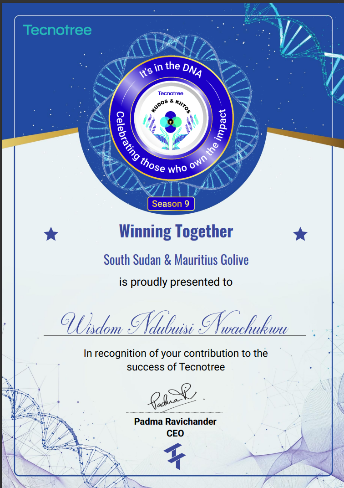
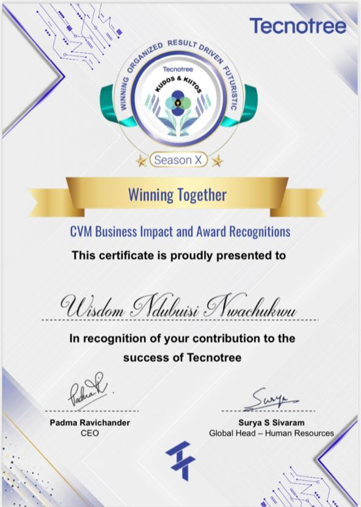

# 👋 Hi, I'm Wisdom Nwachukwu Ndubuisi

Senior Data Engineer | Kafka · Flink · Spark · Databricks | Real-Time Streaming & Lakehouse Architecture | Open to Remote Roles

I design and build scalable data platforms using technologies like Apache Spark, Kafka, NiFi, Flink, and Delta Lake.  
I specialize in building cost-efficient data architectures for both batch and streaming use cases, and I share real-world systems through educational content on YouTube.

---

## 🧰 Toolset

**Big Data & Streaming:** Apache Spark, Databricks, Apache Flink, Apache Kafka, Apache NiFi, Airflow, Delta Lake, Debezium (CDC)
**Languages:** Python (PySpark, PyFlink, Pandas), SQL (PostgreSQL, MS SQL), Shell Scripting
**Databases & Storage:** MinIO, MongoDB, Redis, PostgreSQL, Oracle, OneLake
**Backend Development:** FastAPI, Flask, Django (API Development)
**Cloud & DevOps:** Databricks, AWS, Microsoft Fabric, Kubernetes, Docker, Helm, Jenkins, Git
**Data Formats:** Parquet, Avro, JSON, CSV  
**Other Tools:** DBT

---

## 📦 Key Projects

Note: All my production systems and source code are hosted in private GitLab repositories under NDA.  
Feel free to reach out if you'd like to discuss specific use cases or pipelines I've implemented.

### -> Telecom Campaign Workflow Engine
Built a scalable backend engine using **Flask**, **Kafka**, and **Apache Flink** to execute dynamic marketing workflows. System supports real-time user segmentation and triggers millions of targeted messages based on behavioral data.

### -> Spark Data Lake Pipeline
Developed a batch data pipeline using **Apache NiFi**, **Apache Spark**, and **MinIO**, with **MongoDB** as the sink. Reduced daily ingestion time from manual 20-minute processes to a few seconds. Scaled across multiple telco clients.

### -> Change Data Capture Platform
Implemented a CDC system capturing change logs from **MongoDB**, **Oracle**, and **PostgreSQL**, streaming to **Kafka**, and processing in **Flink** for real-time event-based processing and business rule execution.

### -> SFTP Ingestion & Data Preparation Pipeline
Built a data ingestion workflow with **NiFi** and **Spark Structured Streaming** that pulls CSV files from **SFTP**, transforms and cleans data using custom business logic, and stores the output in **MongoDB** for downstream analytics and segmentation.

---

## 🏆 Recognition & Awards

- **Award of Excellence in Data Engineering**  
  Honored by **Tecnotree Corporation** for solely building and scaling the **data engineering pipeline** within a major production deployment for **Zain South Sudan & Mauritius**.  
  [📄 View Full Award Certificate (PDF)](https://drive.google.com/file/d/15Jd18h3uR3Dss_FDG7jGTyjLoKgnQ3lT/view?usp=drive_link)

- **CVM Business Impact and Recognitions**  
  Recognized under the CVM (Customer Value Management) Business Impact category for contributing to data-driven initiatives that supported measurable business outcomes.
  The award acknowledges impactful work in building and optimizing data systems that enabled commercial decision-making and operational efficiency.

  [📄 View Full Award Certificate (PDF)](https://drive.google.com/file/d/1AQyZPH79HjLAbOaOR0l7zI78H_NZVwAl/view?usp=drive_link)

---

## 🎥 YouTube — @DataWithWisdom

I create tutorials on building real-world data pipelines with Python, Spark, Kafka, Flink, and NiFi.  
🎬 [youtube.com/@DataWithWisdom](https://www.youtube.com/@DataWithWisdom)

<!--
---

## 🔭 Currently Exploring

- Cloud-native data engineering with **Azure**:
  - Azure Data Factory (ADF)
  - Azure Synapse Analytics
  - Data Lake Gen2
- Efficient deployment of streaming systems on Kubernetes
-->
---

## 🔗 Connect With Me

- 💼 [LinkedIn](https://linkedin.com/in/nwachukwu-wisdom)  
- 📧 [Email](mailto:crypticwisdom84@gmail.com)
- 🟢 WhatsApp: +2348168317307
<!-- - 📱 Phone: +2348168317307 -->
